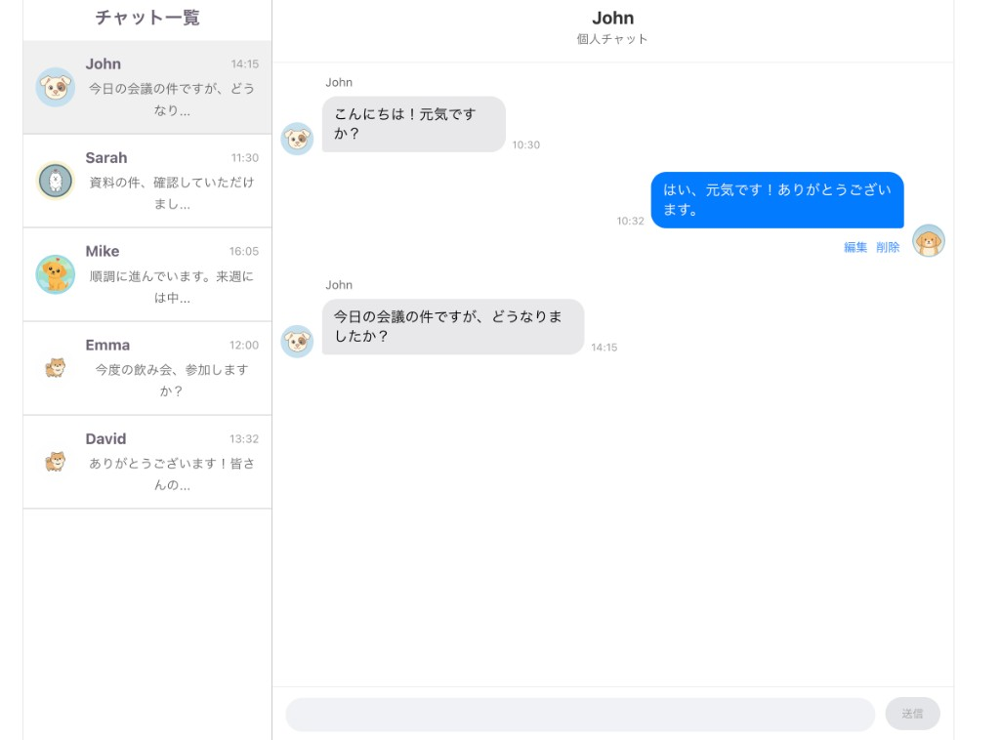
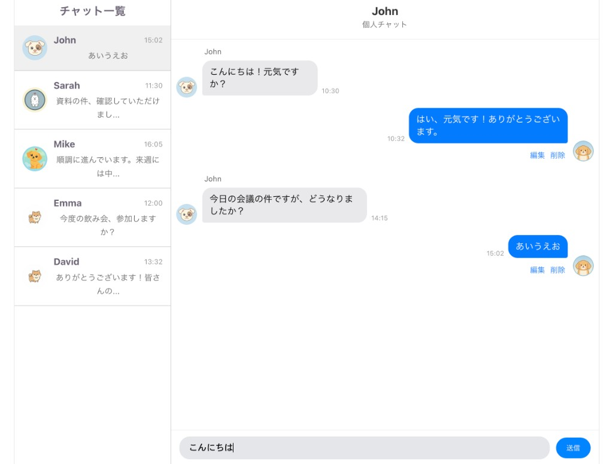
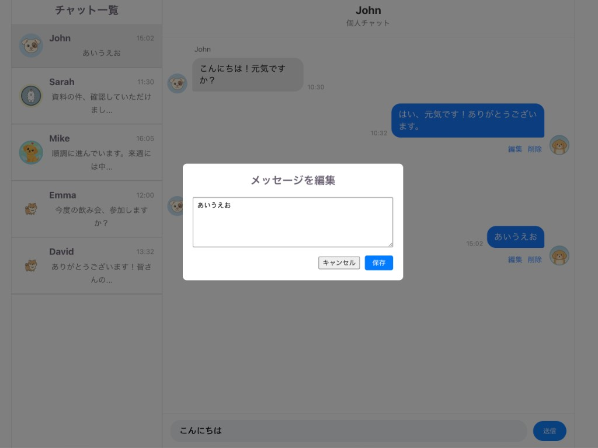
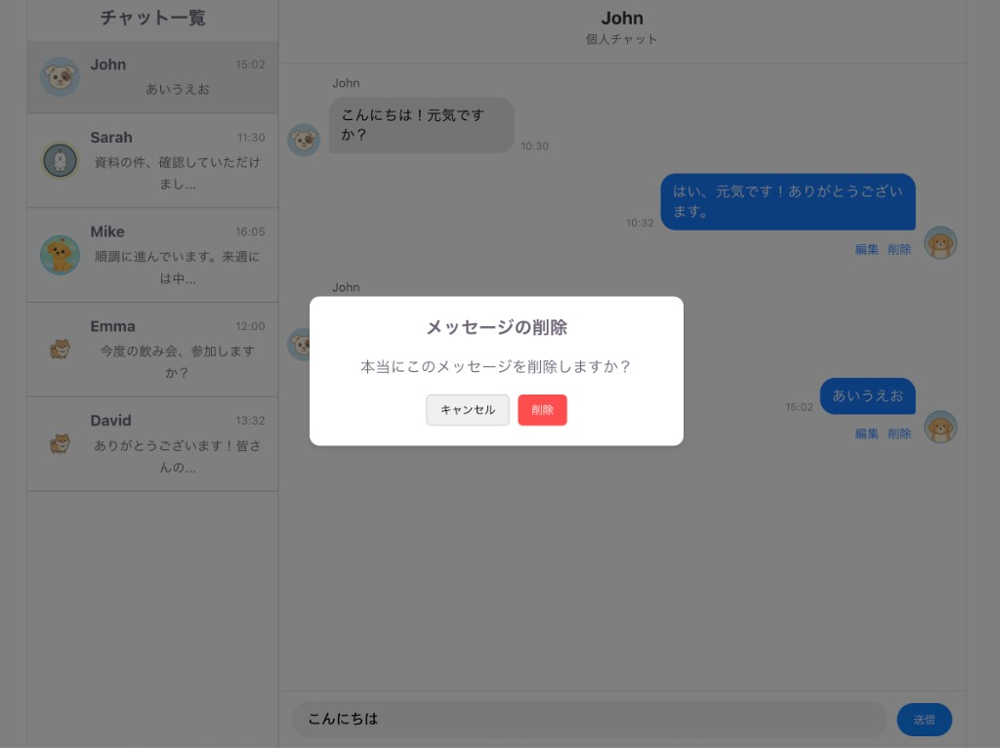

# React Message

Slack / LINE 風の 1 対 1 チャット UI です。React のコンポーネント設計や状態管理を学ぶために作成しました。

**デモ:** https://react-message-zeta.vercel.app/

## スクリーンショット

| 初期画面                                       | メッセージ送信                                            |
| ---------------------------------------------- | --------------------------------------------------------- |
|  |  |

| メッセージ編集                                          | 削除確認                                              |
| ------------------------------------------------------- | ----------------------------------------------------- |
|  |  |

## 機能

- チャット一覧（最新メッセージ・時刻の表示）
- メッセージの送信
- 自分のメッセージの編集・削除（確認モーダル付き）
- チャット切り替え時の下書き保持
- メッセージ送信後の自動スクロール
- テキストエリアの自動高さ調整
- Enter で送信（Shift + Enter で改行、日本語 IME 入力中は送信しない）

## 技術スタック

- React 19
- Vite
- JavaScript (ES Modules)

## 動作環境

- Node.js 18 以上（推奨）

## セットアップ

### 1. リポジトリの取得と依存関係のインストール

```bash
git clone https://github.com/Kenichi585-sys/react-message.git
cd react-message
npm install
```

`git clone` すると、デフォルトではリポジトリ名（`react-message`）のフォルダが作成されます。別名で clone したい場合は `git clone <URL> 任意のフォルダ名` と指定できます。

### 2. 開発サーバーの起動（日常の開発用）

```bash
npm run dev
```

ターミナルに表示される URL をブラウザで開きます（Vite のデフォルトは `http://localhost:5173` です）。

> **補足:** ローカルで開発するときは `npm run dev` だけで十分です。`npm run build` は開発中には不要です。

### 3. 本番ビルドの確認（任意）

デプロイ前に、本番用のビルドが問題なく通るか確認したい場合のみ実行します。

```bash
npm run build
npm run preview
```

- `npm run build` … 本番用の静的ファイルを `dist/` に生成する
- `npm run preview` … 生成された `dist/` をローカルで表示して動作確認する

開発サーバー（`npm run dev`）とは別のコマンドです。通常の開発フローでは 2 と 3 を続けて実行する必要はありません。

## プロジェクト構成

```
src/
├── components/       # UI コンポーネント
│   ├── Sidebar.jsx       # チャット一覧
│   ├── ChatWindow.jsx    # メッセージ表示
│   ├── MessageInput.jsx  # 入力欄・送信ボタン
│   ├── EditModal.jsx     # 編集モーダル
│   └── DeleteModal.jsx   # 削除確認モーダル
├── hooks/
│   └── useChat.js        # チャットの状態管理・操作ロジック
├── utils/
│   └── keyboard.js       # Enter 送信のキーボード処理
├── data.jsx              # ダミーデータ（ユーザー・メッセージ）
├── App.jsx
└── main.jsx
```

## 設計メモ

- チャット関連の状態と操作は `useChat` フックに集約し、`App.jsx` はレイアウトと props の受け渡しに専念しています
- チャットごとに下書き（`drafts`）を保持し、会話を切り替えても入力内容が残ります
- 日本語入力時に Enter で誤送信しないよう、`isComposing` をチェックしています
- データはブラウザ内のダミーデータ（`data.jsx`）を使用しており、サーバーとの通信は行いません。ページをリロードすると変更はリセットされます
